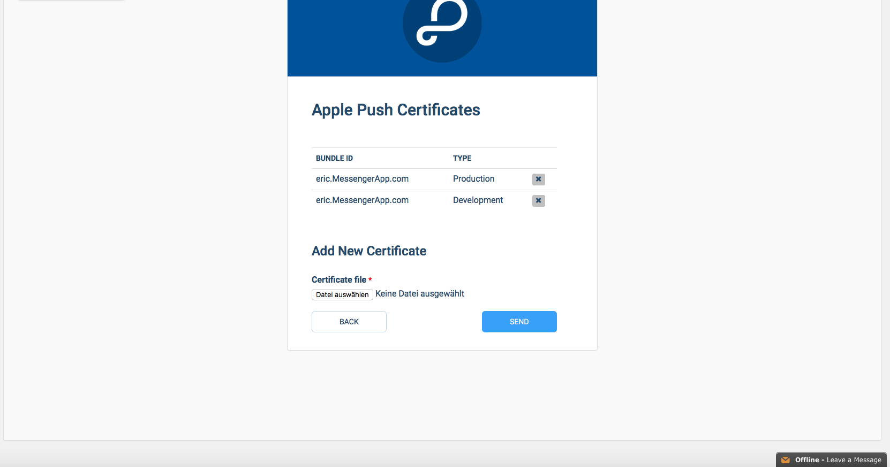

[Private Messenger Application](#)

*   [PRELIMINARIES](#preliminaries "PRELIMINARIES")
*   [FIRST STEPS](#first_steps "FIRST STEPS")
    *   [Back4App Integration](#first_steps_back4app_integration_nbsp) 
    *   [Firebase Integration](#first_steps_firebase_integration)
    *   [Facebook Integration](#first_steps_facebook_integration)
*   [RESKINNING](#reskinning "RESKINNING")
*   [FAQ](#faq "FAQ")
*   [DEPENDENCIES](#dependencies "DEPENDENCIES")
*   [LICENSE](#license "LICENSE")

Private Messenger Application
=============================

This is the source code for my instant messaging application. This documentation guides you through the setup and explains, step by step, the basics of the code, so that you can modify and customise it easily. 

### PRELIMINARIES

* * *

The project initially used [Parse](http://www.parse.com) as backend - a service that lets you host your data and essentially spares you of the whole server-side programmation, you don't need to write a single line of server-side code (PHP, etc.). This is a huge advantage, because you, as a developer, can completely focus on creating a wonderful user interface and experience, without having to think much about data modelling - you send your data to parse, and they store it for you. Fortunately, Parse has a great free plan, where you can store 20GB of files, 20GB of database and even transfer 1TB of data - for free! This means you have enough space for your users and don't need to host expensive servers. Additionally, Parse offers a Push Notification service (which is really cool for a social network). Concerning the login, we also make use of the [Facebook SDK](https://developers.facebook.com/docs/ios), because we do not only offer a classic username/password login, but also a Facebook login via Facebook button. **However**, Parse announced that they will shut down by January 27, 2017. Hence, we were forced to adopt an alternative solution. We opted for [back4app](https://www.back4app.com), a service that lets you host your own MongoDB, and your own Parse API in order to continue working with the exact same backend code in the app. This works as follows: back4app installs the Parse API for you on their servers and gives you a dedicated MongoDB where you can store your data. The results are fantastic: you can continue using the powerful API built by Parse, but don't have to mess around with setting up a server on your own. Basically, they are doing the same thing Parse did. Fantastic news! And it really is plug 'n play, and easy to migrate.

We also decided to use [Firebase](http://www.firebase.com) alongside with Parse API. Roughly, we store the messages and the chatrooms on Firebase but the proper users on back4app with the Parse API. This has some very good reasons, it reduces the latency of the messenger and allows us to integrate read and delivered receipts and live messaging. 

In the folder you have downloaded are two files called `Documentation.html` and `Documentation.pdf`. These files are a complete documentation of the whole source code, simply double click on the .html file and the documentation should open in your browser. In case the .html documentation doesn't work, use the .pdf documentation (although the layout of the .html version is much better). Nearly every method that is not a delegate method from the iOS or Parse SDK and practically every declared variable is explained in this documentation.

The next sections will guide you through the basic setup, explain you the functional principle of the project and tell you what you have to know about this project and its dependencies. There are, however, a few things I'd like to mention here, because you need to know them in order to understand the code. The project contains two very important helper classes: the `ESConstants` and the `ESUtility` classes. 

* The **ESConstants** files contain all the important constants for the whole project. Most of the strings you find there are related to Parse and the datamodel we use to store our data. You have to understand that, although Parse.com is messing around with the data for us, we have to store the data efficiently and with a clever system so that we can gather any data we need at any moment and without much effort. Let's look for example at the user class in Parse.com. A  model user has a unique objectId, a username, a mail adress, a password, a display name, a lower version of the display name, maybe a facebookID, etc. You see, there are lots of keys we need to assign to a user - and these keys have unique names. Thus, we define these keys in the `ESConstants` class, avoiding to get confused while using them.   
Here is an example, can you guess what we need this key for? 

```objc
NSString *const kESUserDisplayNameKey   = @"displayName";
```

* The **ESUtility** is, obviously, a utility class where we define public methods that are oftenly used. An example is sending a push notification to a user:

```objc
+ (void)sendPushNotificationToGroup:(NSString *)groupId withText:(NSString *)text andTitle:(NSString *)title
```

One last general notice before we begin - most of the time I denote files and classes by writing their names in italics, for example `ESConstants.m` file. The folder in which these files are lying will be denoted by the following procedure: `SocialNetwork > Supporting Files` folder. What I mean is that the `ESConstants.m` file is in the `Supporting Files` folder which is a subfolder of the `SocialNetwork` folder. Alright? Let's go!

### FIRST STEPS

* * *

Obviously, the first thing to do, is to open the project. You will find the .xcodeproj file in the same folder you found the documentation, double click the file, and XCode should open you the well-known project window. 


Don't be overwhelmed by the number of files in the project, it is a complete messenger project, so there is a certain number of different classes. Instead, immediately try to run the application for the very first time on your device or on the simulator. It should work without any problems. If you do encounter problems you can't solve on your own, please don't hesitate to contact me. Normally, you shouldn't encounter any problems, and the project should run properly, without having changed anything. In that case, you'll see the app on your device (or simulator) - you can begin to navigate through it, become familiar with it, but we need to change some things before you can really call this chat app your own.

We'll start with integrating your own Back4App app.   
 

#### Back4App Integration 

First things first: If you are looking to migrate your existing Parse app over to back4app, please head over to the migration section. If you don't have a Parse App of this messenger and want to create a back4app app with Parse API, this is the right section for you.

At the moment, you still run the app with my preset database on my back4app account. You need to register yourself at back4app.com, and create a new Parse app (the name is your choice). Once you've done that, you should familiarize yourself a bit with back4app and the open-sourced Parse dashboard (currently empty).


Navigate to the Core Settings section on the left (right under the 'Settings' section). There, you'll have to copy the `APPLICATION ID` and the `CLIENT KEY`. In your XCode project again, navigate to the `AppDelegate.m` file which is in the `App` folder in the project navigator. You'll see the 'application:didFinishLaunchingWithOptions' method in the `AppDelegate.m`. In the beginning of the method is mentioned an APPLICATION ID and a CLIENT KEY - exchange these keys with the ones you have copied from your app's settings on back4app.com:

```objc
[Parse initializeWithConfiguration:[ParseClientConfiguration configurationWithBlock:^(id<ParseMutableClientConfiguration> configuration) {
    configuration.applicationId = @"APPLICATION_ID";
    configuration.clientKey = @"CLIENT_KEY";
    configuration.server = @"https://parseapi.back4app.com";
}]];
```

Run the project again, there should be no problem at all (except for the facebook login). To clarify - what you've done now, is giving your project another backend app on back4app, which means that your app now gets its data from another databrowser, your own databrowser (and not the one I have preset) because you want to have control over the data, don't you?

We're nearly done with the back4app.com part, the last thing to do is connect our Parse app with the Facebook login in the project. Therefore, go to the [developers page](https://developers.facebook.com) of Facebook.

#### Firebase Integration

As already mentioned, this project uses Firebase to store the actual messages and conversations you write to another user. That means that you need to register yourself at [Firebase.com](http://www.firebase.com) (don't use the old legacy console) and create a new app with your own custom and fancy name. After finishing the registration and creating your own app, go to the database section and select the "Rules" tab. Add the following lines to your rules:

```json
{
    "rules": {
        ".read": true,
        ".write": true,
        "Recent": {
            ".indexOn": ["groupId", "userId"]
        },
        "users": {
            "$uid": {
                ".write": "auth !== null && auth.uid === $uid",
                ".read": "auth !== null && auth.provider === 'password'"
            }
        }
    }
}
```

It should look like this:


Next, we will have to download the "GoogleService-Info.plist". To do this, hit the Settings/Gear-Button and go to project settings. You will be presented with the following view, which enables you to download the necessary .plist. Simply add that .plist to your .xcodeproj by simply dragging it right under the normal "Info.plist" in XCode. This ensures, that your project is pointing to the right Firebase app.


That's it for the Firebase part (nearly, still missing the Facebook login, but we'll get back to this in a moment). Now let's first create a new Facebook app to allow Facebook login in the app:

#### Facebook Integration

Create a new app on the developers page of Facebook (again, the name is your choice). Once you've done that, you'll be presented with the dashboard view of the Facebook app. In this view copy the `APP ID` and the `APP SECRET` keys and, in your XCode project, navigate to the `Info.plist` file, which is in the `App > Supporting Files` folder in the project navigator.


In the `Info.plist` file you have to change three things:

* the 'FacebookAppID' value should match you APP ID you copied from the Facebook developers page  
* the 'Facebook Display Name' value should match the display name you chose for your app on the Facebook developers page  
* in the 'URL Types' key, you'll find an 'Item 0' with an 'URL Schemes' key. In this key, change the value for 'Item 0'  to match your custom url scheme. Normally, this is `fbYOUR_APP_ID`.


Back to the Facebook developers page. Go to the Settings tab of your Facebook app and add a new platform. Choose iOS as platform and enter your bundle ID (per default eric.MessengerApp.com, but you should change this to match your own), as well as the URL Scheme you just created in the `Info.plist`. Don't forget to save the changes.


Now back to back4app. In the Facebook OAuth settings tab of your back4app app, you have to enter your Facebook APP ID and hit save! 


And now finally back to the Firebase console, where you have to head to the Authentication section and click on the "authentication methods" tab. There, you'll have to enable Facebook login and enter your App ID and App-Secret you got from the developer.facebook page, just the same as you did it for back4app a few seconds ago. Also make sure that email/password authentication is enabled.


Notice, that the screenshot above also tells you to copy the OAuth URI (you copy your own one, of course) and enter it into your Facebook app's settings. Just like this:


That's it. Run your project again, and try to login with Facebook (only on your physical device). If you've setup your Facebook profile on your device, you'll be asked to grant Facebook some basic permissions and once you've done that, you're ready to go an are signed up to the social network.

I know this seems like it's very complex and difficult to setup. The truth is - you're right! It is complex, because we need to handle three different services at a time. Imagine also having Twitter authentication, etc., what a nightmare! We'll leave it with the Facebook login and the email/password login, that should suffice for most of our users. 

The last part to do, is messing around with the Parse Push Notifications. That's what we'll do in the following steps.

**Push Notifications**

But first some important things about push notifications. First of all, we need to register our app for push notifications at back4app.com and in the iOS Developper Center from Apple (we'll do that in a few moments).  
The next important thing is, that we basically have two possibilities to send pushes with the Parse API in an iOS project. The first one is to do it from inside the source code, this is a so-called 'client-side' push because the user (client) creates the push from inside the app (by sending a message, for example). This method is hardcoded in the source code and therefore potentially a bit more insecure than method two: the Cloud Code Push Notification. Back4app allows you not only to store data but also Javascript code on their servers, which will NOT be in your app, but only on the servers. This comes with one great advantage: In case an offender modifies the source code of your app (yes, this can actually happen), he will not be able to repeatedly trigger the push notification code, because there simply is none in the app's source code, it's all server-based. That's cool, isn't it? For sensitive code snippets, it's always a good idea to run them on the cloud and not in the app itself. Keep that in mind.

Now back to the project - in this project I have used cloud push. This is done the following way: whenever a user sends a message, a specific cloud code method is invoked by the client (the user's device). This method deals with sending the correct push with the correct message to the correct recipient. But, for this to work, you will have to have to things in place: the cloud code method itself (of course) and some Push Notifications Certificates that allow you to send notifications to iOS devices in the first place.

To upload the cloud code method, simply upload the content of the "Cloud Code" folder (which is in the "Speak" folder, so in the same folder where you found the .xcodeproj file) to back4app. This is done via the Cloud Code tab in your back4app app settings. Make sure the file tree looks exactly like this:


Finally, you'll have to generate your certificates...

Back4app has an excellent [Quick Guide for iOS Push Notifications](https://docs.back4app.com/docs/ios/push-notifications/push-dashboard-swift/), which guides you through the (a bit complicated) setup to create the certificates. Basically, you have to generate some signing certificates and enable Push Services in your iOS Dev Center from Apple. This is the moment to choose your app's Bundle ID and replace the old 'eric.MessengerApp.com' Bundle ID in the `Info.plist` file with your new one, if you haven't done it already (you should, because changing it now will affect your Facebook login, and you'll have to update the Bundle ID also on Facebook's developer page). You can now also change the 'Bundle Display Name' in the `Info.plist` to match your own cool app name. At the end of Parse's push tutorial, you should have a .p12 file, which you can upload to back4app.com



Once you're done with setting up the pushes, run your app again (ideally on two different physical devices, with two different users), and send a message from one user to anothere - you'll see that the pushes will arrive on the respective devices, if you've done the setup correctly.

Again, if you have any problems, questions or suggestions, please don't hesitate to contact me. 

### RESKINNING

* * *

**Reskinning the project is substantial for you in order not to infringe any copyrights you don't hold.** 

Thus, I will explain in this section how to reskin the project in order to match your personal and needed design. In case you have no coding experience at all, you might not find it trivial to customise the look of the app. Otherwise, you might find it extremely trivial to do it. 

We'll start with the icon. You need to exchange the icons in the `App > Images.xcassets` folder with your custom icons, respecting the corresponding sizes. These sizes depend on the targeted devices as well as on the targeted iOS version.

Next, we'll have a look at the launch screen, the very first screen that pops up before you really enter the app. Currently it shows the title of the app (`LuxChat`) as well as the author's name and website. To customise this screen, you need to head over to the `LaunchScreen.xib` file, which is also in the `App` folder.

As soon as you have done these things, you can start changing the basic design of the app. In the `Resources` folder, you'll see a whole bunch of images that are used throughout the app. When reskinning them, pay attention to their exact resolution and name, as those two things should not change. A changed name results in the code not finding the correct image, and you'll need to manually change the name of the image in the code. A modified resolution may result in a distorted display of the image. 

When it comes to color changing, this should be rather straightforward. After having a look at the documentation and getting familiar with the code, you should be able to identify the corresponding classes, find the corresponding line of code being responsible for a certain color of a certain object and change this exact color to match your desired one. In case you encounter any difficulties, please do not hesitate to contact me, I'll be happy to assist you.

In the FAQ are some general tips on how to change basic things.

### FAQ

* * *

Here are some FAQ's listed.

**What do I need to change in the info.plist?**

In the Info.plist change the following keys:

* Bundle ID value  
* Bundle Display Name  
* Facebook Display Name  
* FacebookAppID  
* URL scheme

**Do I need to link my app against Firebase somewhere in the code?**

Of course, in the `ESConstants.h` file:

```objc
#define kESFirebase @"https://YOUR_APP.firebaseio.com"
```

**Do I need to link my app against back4app somewhere in the code?**

In the `AppDelegate.m` file, change the AppID and the CientKey to match yours:

```objc
[Parse initializeWithConfiguration:[ParseClientConfiguration configurationWithBlock:^(id<ParseMutableClientConfiguration> configuration) {
    configuration.applicationId = @"hqUeDpRbVTDp19kmQqSx59j5FKv0G0sMpoIGSHHM";
    configuration.clientKey = @"zQzZ9ilcg5uobEIYBJU90wHkaPRXJ9lp5zxFZqYj";
    configuration.server = @"https://parseapi.back4app.com";
}]];
```

**How do I setup Push Notifications?**

Parse has a great push notification setup guide, you should check it out! Basically, you need to create a .p12 file and upload it to back4app.com.

**How to change the color of the tabbar?**

In this project, the tabbar is added programmatically - thus all the changes are made in the `AppDelegate.m` file. To change the tint color of the tabbar, modify this line:

```objc
[[UITabBar appearance] setTintColor:[UIColor colorWithRed:60.0f/255.0f green:133.0f/255.0f blue:255.0f/255.0f alpha:1.0f]];
```
And to change the bar tint of the tabbar, modify this line:

```objc
[[UITabBar appearance] setBarTintColor:[UIColor colorWithRed:0.9647 green:0.9647 blue:0.9647 alpha:1]];
```

**How do I change the images and the text of the tabbar?**

These things are handled by the different tab viewcontrollers themselves. Here is an example of the conversations viewcontroller, the first tab of the four - the others are handled similarily. To change the image of the recent conversations, open the `ESRecentView.m` file which is in the `Classes > Tabs > Recent Conversations` folder. In the `initWithNibName:bundle:` method, you'll find the following line:

```objc
[self.tabBarItem setImage:[UIImage imageNamed:@"tab_recent"]];
```
This sets the image. To change the title, have a look at the line right after the above one:

```objc
self.tabBarItem.title = @"Chats";
```

**How do I change the colour of the navigation bar?** 

Again, this is fairly easy. It's at the exact same place where you already changed the tabbar colors - in the `AppDelegate.m` file. Change the following lines:

```objc
 [[UINavigationBar appearance] setBarTintColor:[UIColor colorWithRed:0.9647 green:0.9647 blue:0.9647 alpha:1]];
 [[UINavigationBar appearance] setTintColor:[UIColor colorWithRed:60.0f/255.0f green:133.0f/255.0f blue:255.0f/255.0f alpha:1.0f]];
```

**How do I change the text and color of the title on navigation bar?** 

If you want to change the title of a specific viewcontroller, simply search for the following lines in the `viewDidLoad` method:

```objc
UIColor *color = [UIColor darkGrayColor]; NSMutableDictionary *navBarTextAttributes = [NSMutableDictionary dictionaryWithCapacity:1];
[navBarTextAttributes setObject:color forKey:NSForegroundColorAttributeName ];
[navBarTextAttributes setObject:[UIFont fontWithName:@"HelveticaNeue-Bold" size:15]forKey:NSFontAttributeName];
self.navigationController.navigationBar.titleTextAttributes = navBarTextAttributes;
self.navigationItem.title = @"CHATS";
```

**What about the privacy terms and the usage terms?**

Those html files are terms. You need to customise them to fit your special need.

### DEPENDENCIES

* * *

As you may have already seen, this project depends on a certain number of other libraries, frameworks and open source projects.

Here is a quick list of the most important ones, mostly under MIT License, for those not having an open source license, a license has been bought by myself:

* Basic Messenger: This whole project is based on [JSQMessagesViewController](https://github.com/jessesquires/JSQMessagesViewController) and JSQSystemSoundPlayer by Jesse Squires, as well as [NotificationChat](https://github.com/relatedcode/NotificationChat) by RelatedCode 

* Spinning wheel: [MBProgressHUD](https://github.com/jdg/MBProgressHUD) by Jonathan George and [ProgressHUD](https://github.com/relatedcode/ProgressHUD) by RelatedCode

* Audio recorder for the Messenger: [IQAudioRecorderController](https://github.com/hackiftekhar/IQAudioRecorderController) by Mohd Iftekhar Qurashi

* A Networking library: [AFNetworking](https://github.com/AFNetworking/AFNetworking) by AFNetworking

* A stylish About view: [RFAboutView](https://github.com/fouquet/RFAboutView) by René Fouquet

* In-app-Webbrowser: [TOWebViewController](https://github.com/TimOliver/TOWebViewController) by Tom Oliver

* In-app-Notifications: [CRToast](https://github.com/cruffenach/CRToast) by Collin Ruffenach

* Badge view: [JSBadgeView](https://github.com/JaviSoto/JSBadgeView) by Javier Soto

These are the most important ones, and they have all done some incredible good work! I'd like to thank them all, and also the ones that have not been named here, but are listed in the project itself. Open sourcing source code to help other developers build better products is a great move. Thanks.

### LICENSE

* * *

Copyright (c) 2021 Eric Schanet

Permission is hereby granted, free of charge, to any person obtaining a copy
of this software and associated documentation files (the "Software"), to deal
in the Software without restriction, including without limitation the rights
to use, copy, modify, merge, publish, distribute, sublicense, and/or sell
copies of the Software, and to permit persons to whom the Software is
furnished to do so, subject to the following conditions:

The above copyright notice and this permission notice shall be included in all
copies or substantial portions of the Software.

THE SOFTWARE IS PROVIDED "AS IS", WITHOUT WARRANTY OF ANY KIND, EXPRESS OR
IMPLIED, INCLUDING BUT NOT LIMITED TO THE WARRANTIES OF MERCHANTABILITY,
FITNESS FOR A PARTICULAR PURPOSE AND NONINFRINGEMENT. IN NO EVENT SHALL THE
AUTHORS OR COPYRIGHT HOLDERS BE LIABLE FOR ANY CLAIM, DAMAGES OR OTHER
LIABILITY, WHETHER IN AN ACTION OF CONTRACT, TORT OR OTHERWISE, ARISING FROM,
OUT OF OR IN CONNECTION WITH THE SOFTWARE OR THE USE OR OTHER DEALINGS IN THE
SOFTWARE.


* * *
